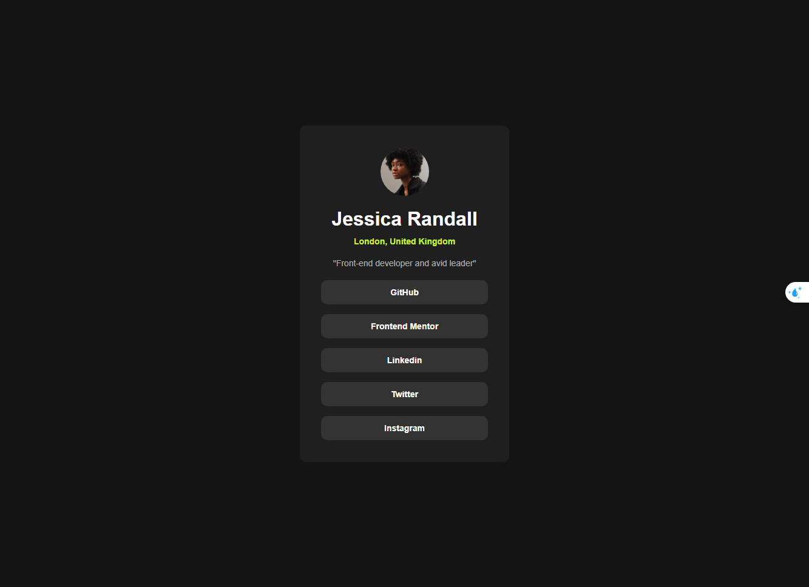

# Frontend Mentor - Social links profile solution

This is a solution to the [Social links profile challenge on Frontend Mentor](https://www.frontendmentor.io/challenges/social-links-profile-UG32l9m6dQ). Frontend Mentor challenges help you improve your coding skills by building realistic projects. 

## Table of contents

- [Overview](#overview)
  - [The challenge](#the-challenge)
  - [Screenshot](#screenshot)
  - [Links](#links)
- [My process](#my-process)
  - [Built with](#built-with)
  - [What I learned](#what-i-learned)
  - [Continued development](#continued-development)
- [Author](#author)


**Note: Delete this note and update the table of contents based on what sections you keep.**

## Overview

### The challenge

Users should be able to:

- Align layout properly and precisely

### Screenshot



### Links

- Solution URL: https://github.com/Hueiboi/fem-socials-link-profile.git
- Live Site URL: https://femsociallinks.netlify.app/

## My process

### Built with

- Semantic HTML5 markup
- CSS custom properties
- Flexbox

### What I learned

What I learned was how to align the layout and elements inside the card correctly and properly.

```css
.profile__socials {
      font-size: 14px;
      list-style: none;
      display: flex;
      flex-direction: column;
      align-items: center;
      gap: 16px;
      width: 100%;
    }

    .socials__item {
      font-size: 14px;
      font-weight: 700;
      width: 100%;
      text-align: center;
      padding: 12px;
      background-color: hsl(0, 0%, 20%);
      min-width: 275px;
      border-radius: 10px;
    }
```

### Continued development

I would like to be able to practice more flexible layout alignment and layout like grid in future projects.

## Author

- Frontend Mentor - [@yourusername](https://www.frontendmentor.io/profile/yourusername)


